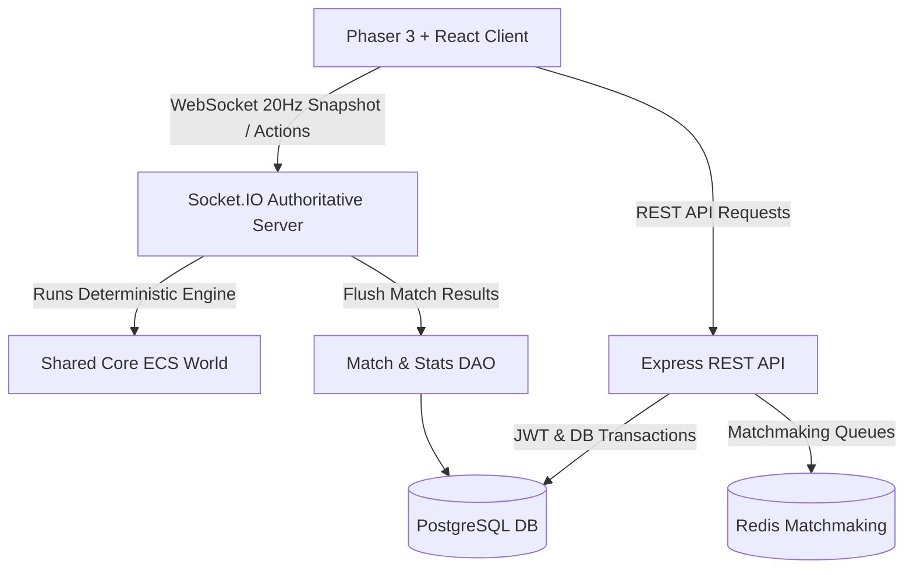

# RealmForge Architectural Design Document

RealmForge is a high-performance, real-time multiplayer tower defense game engineered with a deterministic shared core engine, an authoritative Node.js game server, Redis-backed matchmaking, PostgreSQL persistence, and a hybrid Phaser 3 / React web client.

---

## 1. System Overview & Monorepo Layout

The repository is structured as a TypeScript npm monorepo with strict package boundaries:

```
RealmForge/
├── shared/           # @realmforge/shared: Deterministic ECS, Pathfinding, Combat, Waves, Types
├── server/           # @realmforge/server: Express API, Socket.IO Authoritative Server, Matchmaker, DAO Repos
├── client/           # @realmforge/client: React Shell, Phaser 3 Canvas, Socket Context, Tailwind CSS
├── tests/            # @realmforge/tests: Unit tests, Supertest API integration tests, Playwright E2E
├── docker-compose.yml
└── .github/workflows/ci.yml
```



---

## 2. Deterministic ECS Engine Core (`shared/src/engine/`)

### Fixed-Step Simulation Loop (20 Hz)
- The simulation advances in deterministic 50ms discrete steps (`MS_PER_TICK = 50`).
- Mathematical randomness uses a 32-bit seeded Mulberry32 PRNG.
- Floating-point calculations adhere to fixed rounding constraints to prevent desyncs across network boundaries.

### Entity Component System (ECS)
Entities are integers querying bitmask archetypes:
- **`TransformComponent`**: 2D World coordinates `(x, y)` and rotation angle.
- **`TowerComponent`**: Tower type (`ARCHER`, `MAGE`, `CANNON`, `TESLA`, `FROST`, `BARRACKS`), tier (1-4), attack cooldown timer, range, and targeting strategy.
- **`EnemyComponent`**: Creep archetype (`SWARM`, `GOBLIN`, `ORC_BRUTE`, etc.), speed, armor, magic resistance, bounty, and current waypoint index along path.
- **`HealthComponent`**: Current and maximum HP.
- **`ProjectileComponent`**: Homing physics, splash radius, and elemental damage types (`PHYSICAL`, `MAGICAL`, `TRUE_DAMAGE`, `FROST`, `LIGHTNING`).
- **`BuffComponent`**: Status effects (`SLOW`, `BURN`, `STUN`, `ARMOR_SHRED`).

### State Checksum & Desynchronization Detection
At the end of each simulation tick, the server computes a 32-bit FNV-1a hash over all entity positions, active creep health, and player balances:
```typescript
const checksum = StateHasher.hashWorldState(tickNumber, entities);
```
Clients match their local simulation hash against the server snapshot checksum. If a mismatch is detected, the client immediately resynchronizes to the server's authoritative state snapshot.

---

## 3. Map & A* Pathfinding (`shared/src/map/`)

- 2D grid matrix with tile classifications: `GROUND`, `PATH`, `OBSTACLE`, `SPAWN_POINT`, `NEXUS_BASE`.
- **A* Pathfinder with Min-Heap Priority Queue**: Calculates optimal creep navigation from spawn nodes to the player's nexus.
- **Anti-Blocking Validation**: Prevents players from placing towers on tiles that would fully obstruct all traversable paths from any spawn point to the nexus.

---

## 4. Combat Damage & Armor Formulas (`shared/src/combat/`)

### Armor Damage Reduction
$$\text{Physical Damage Multiplier} = \frac{100}{100 + \text{Armor}}$$

### Magic Resistance
$$\text{Magical Damage Multiplier} = \frac{100}{100 + \text{Magic Resistance}}$$

### Critical Hits & True Damage
- **True Damage**: Completely ignores armor and magic resistance.
- **Critical Strike**: Multiplies base attack damage by critical multiplier (e.g. $\times 2.0$).
- **Chain Lightning Decay**: Tesla towers discharge lightning arcs that chain between up to 4 targets with $25\%$ damage decay per consecutive jump.

---

## 5. Wave Generation & Procedural Scaling (`shared/src/waves/`)

Waves scale exponentially with wave number $N$:
$$\text{HP}(N) = \text{BaseHP} \times (1 + 0.18 \times N)^{1.35}$$
$$\text{Speed}(N) = \min(2.5, \text{BaseSpeed} \times (1 + 0.015 \times N))$$
- Boss waves occur every 5 waves (introducing massive Titan monsters with CC resistance and devastating AoE attacks).

---

## 6. Redis Matchmaking & Dynamic Window Expansion (`server/src/matchmaking/`)

- Players join queue using Redis Sorted Sets scored by their ELO rating.
- The search window dynamically widens over wait time:
  - $0 - 5\text{s}$: $\pm 50 \text{ ELO}$
  - $5 - 15\text{s}$: $\pm 150 \text{ ELO}$
  - $15 - 30\text{s}$: $\pm 300 \text{ ELO}$
  - $> 30\text{s}$: $\pm 1000 \text{ ELO}$ (Guaranteed match creation)
- When a compatible squad or opponent is matched, a dedicated `GameRoom` is allocated and players receive socket dispatch.

---

## 7. Persistence & DAO Layer (`server/src/persistence/`)

Data Access Objects (DAO) abstract all persistence operations with dual implementations (`InMemory` for standalone zero-dependency test suites and `Postgres` for production):
- **`IUserRepository`**: BCrypt 12-round password hashing, JWT refresh rotation, profile updates.
- **`IMatchRepository`**: Match creation, team composition, wave survival records, and atomic transaction completion.
- **`IStatsRepository`**: Player win rates, kill counts, damage dealt, and ELO calculations ($K=32$).
- **`ILeaderboardRepository`**: Ranked queries sorted by ELO rating, total victories, and highest wave cleared.
- **`IInventoryRepository`**: Cosmetic catalog purchases, gem validation, and loadout configuration.
- **`IAdminRepository`**: Player griefing reports, user bans, currency grants, and audit logs.
